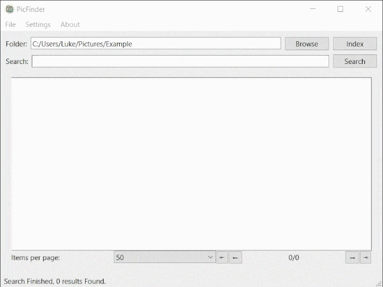

# PicFinder

A simple windows application to search for images in a directory.

## Features

* Search for text in images using OCR. Tested with English, Traditional Chinese, Simplified Chinese.
* Search for objects in images using YOLO11. Labels from COCO.
* Search for images using its class. Labels from ImageNet.
* Supported image formats: formats supported by OpenCV: bmp, dib, jpeg, jpg, jpe, jp2, png, webp, avif, pbm, pgm, ppm, pxm, pnm, pfm, sr, ras, tiff, tif, exr, hdr, pic.

## Usage

1. Download the latest release
2. Run the application
3. Select the directory to Index using models (only required once)
4. Search



If you clone the repository:

1. Install the required packages using Poetry.
2. Put the ONNX format YOLO11 models in the `models` directory.

### Note

 The first time you run the application, it will take some time to index the images in the directory.

 Only YOLO11n and YOLO11n COCO models are included in the minimal release. For more models, download the ONNX format models and put them in the `models` directory.

## EXE creation

### Using Nuitka

    ```bash
    python -m nuitka main.py --standalone --enable-plugin=pyside6  --include-data-dir=./backend/libsimple-windows-x64=lib/backend/libsimple-windows-x64 --include-data-files=./backend/libsimple-windows-x64/simple.dll=lib/backend/libsimple-windows-x64/simple.dll --include-data-dir=./models=models --include-data-dir=./.venv/Lib/site-packages/rapidocr_onnxruntime=rapidocr_onnxruntime --windows-console-mode=disable

    ```

## Details

* OCR is done using [RapidOCR](https://github.com/RapidAI/RapidOCR)
* Object detection adapted from [ONNX-YOLOv8-Object-Detection](https://github.com/ibaiGorordo/ONNX-YOLOv8-Object-Detection)
* Search tokenizer from [Simple](https://github.com/wangfenjin/simple)
* Object detection and image classification model from [YOLO11](https://github.com/ultralytics/ultralytics)
